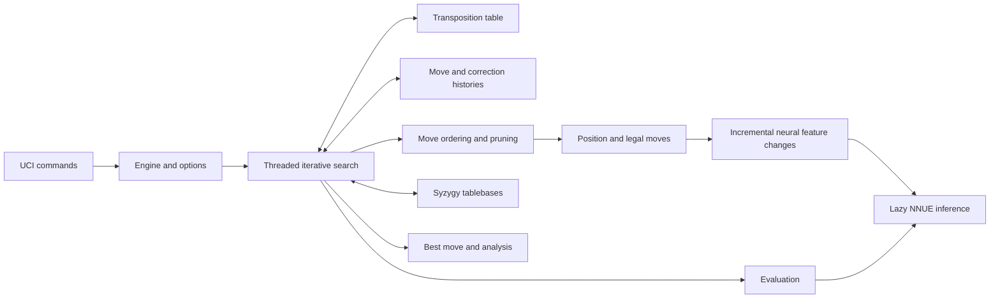

# Repository architecture and research boundaries

Baseline: `031dfeb437fa6b06cdbdf4ef89dfb82f6b83c4d3`, September 13, 2026. This is the source baseline studied, rather than an assumption about an older released Stockfish. All 119 tracked files, totaling 33,039 lines, were read across the team. The accompanying [coverage manifest](coverage.json) records actual reading by the lead, orchestration agent, and two specialist agents, with exact git blobs and a distinction between source and metadata/license text.

## Purpose and organizing idea

Stockfish is a UCI chess engine: it receives a position and a search budget, searches legal continuations, and returns a move and analysis. It is not a chessboard GUI. Its competitive strength comes from a coupled system: inexpensive incremental position updates; a selective alpha-beta search; move ordering and online histories that direct expensive search; a quantized, incrementally updated neural evaluation; shared transposition information; and statistical testing of changes. The [README](../../README.md), [main program](../../src/main.cpp), and [engine interface](../../src/engine.h) establish the product boundary.

The central engineering tradeoff is how to spend a finite search budget. Searching fewer nodes can improve strength if it saves time without losing important continuations. Searching more nodes can improve strength if the additional work repairs unreliable pruning. A faster node, a lower fixed-depth node count, a more intuitively plausible evaluation, and higher Elo are four distinct outcomes. The research therefore seeks narrow mechanisms with testable consequences rather than assuming that an aesthetically cleaner heuristic wins.

## From UCI to a searched move

[`uci.cpp`](../../src/uci.cpp) parses commands and connects engine callbacks to UCI output. [`ucioption.cpp`](../../src/ucioption.cpp) validates option values and records option callbacks. [`engine.cpp`](../../src/engine.cpp) owns the position/state history, thread pool, transposition table, configured NNUE network, and replicated shared histories. Option changes that require a stable engine wait for search to finish. Position setup sanitizes castling information and validates supported FEN states; invalid input is reported rather than allowed to enter the search.

The engine starts asynchronous work in its thread pool. Search performs iterative deepening, aspiration searches, principal-variation search, selective pruning, move reductions/extensions, quiescence search, and history updates. Many heuristics use overlapping evidence: TT depth/bound/value, static evaluation, correction history, capture or quiet classification, prior moves, node type, and whether evaluation is improving. A proposed new confidence signal must be checked against the existing uses of those inputs to avoid paying for a duplicate. [`search.cpp`](../../src/search.cpp), [`search.h`](../../src/search.h), and [`history.h`](../../src/history.h) are the main implementation references.

The UCI score is not a direct dump of an internal pawn value. [`uci.cpp`](../../src/uci.cpp) and [`score.cpp`](../../src/score.cpp) normalize ordinary scores and expose fitted win/draw/loss estimates using game material, while mate scores have separate meaning. Internal score units, displayed centipawns, benchmark node counts, and relative Elo must remain distinct in reports.

## Position state and legality

[`position.cpp`](../../src/position.cpp) maintains board occupancy, colored piece sets, piece counts, Zobrist keys, castling and en-passant state, pins/checkers, material accounting, repetition information, and dirty neural features. `StateInfo` links a reversible history; making a move copies the stable prefix of state and computes the changed suffix. Undo restores the prior state pointer and the moved/captured pieces. Promotion, en passant, and Chess960 castling require explicit handling.

The full position hash, pawn hash, minor-piece hash, per-color non-pawn hashes, and material key represent different abstractions. Their deliberate omissions allow useful generalization but also matter for learning reliability. In particular, structural correction keys do not identify an excluded move in singularity searches. The same board with a move forbidden is a different search question even though its structural features are identical.

Legal en-passant information is incorporated into hashing and repetition behavior. Repetition detection uses incremental distance information and a cuckoo table of reversible moves for upcoming repetitions. Null moves reset the relevant history boundary. The 50-move counter affects draw handling and TT-key adjustment. These are already substantial protections against graph-history problems; simply proposing “add repetition awareness” or “include rule50 in the TT” would overlook existing behavior.

[`movegen.cpp`](../../src/movegen.cpp), [`attacks.cpp`](../../src/attacks.cpp), and [`bitboard.cpp`](../../src/bitboard.cpp) provide fast generated move lists and attack geometry. Legality and static exchange evaluation are separate: a legal move can lose material, and an exchange estimate is a selective tactical approximation. Move ordering occurs before some later search pruning. Consequently, an incorrectly promoted losing quiet move may affect subsequent move counts and reductions even if it is eventually rejected by SEE.

## Neural evaluation in this baseline

This baseline uses a single contemporary network, with the three input sets declared in [`nnue_architecture.h`](../../src/nnue/nnue_architecture.h): `HalfKAv2_hm`, `FullThreats`, and `PP_3Wide`. It should not be described as an older Stockfish dual-network implementation. The default network was updated in the September 13 commit immediately preceding this investigation.

The piece-square feature set is oriented by king location and color; a king crossing an orientation boundary can force refreshing rather than a cheap delta. Full-threat features encode selected piece-to-piece relationships, with symmetry/filtering rules that avoid redundant or unhelpful relationships. Pawn-pair features encode pairs within a three-file band and share a contiguous weight-index domain with threats. Their updates compare before/after pawn bitboards and avoid work when those bitboards are unchanged. All six [feature source files](../../src/nnue/features/) were read by the orchestration agent.

The network implementation separates feature transformation, incremental accumulators and refresh caches, and later quantized layers. SIMD implementations support multiple instruction sets. Changing a feature definition normally entails a compatible trained network; an apparently local C++ change can invalidate the meaning of learned weights. Conversely, a calculation-preserving implementation change can improve strength only through the search work enabled by its speed gain, and that gain can vary across CPU architectures.

The architecture currently transforms the features into 1,024 inputs, uses 32-output first and second layers with squared/linear activation paths, and gathers 128 inputs into the final scalar layer. Eight dense stacks are chosen by material count. Lazy incremental updates, joint-perspective updates, king-refresh caches and sparse input traversal already eliminate substantial computation. The [NNUE study](06-nnue-compute.md) documents these boundaries and explains why its proposed final-layer scheduling change can reuse the existing trained network.

## Exact endgame data and repetition

[`syzygy/tbprobe.cpp`](../../src/syzygy/tbprobe.cpp) handles compressed WDL and DTZ tables, lazy mapping, material indexing, captures/pawn moves/en passant, and root move ranking. DTZ rounding and the current halfmove clock affect which conversions are guaranteed. Earlier repetitions influence root treatment; successful DTZ ranking can disable ordinary internal probes. This prevents treating the tables as interchangeable exact mate-distance evaluations at every node.

When positions are outside tablebase coverage or the probe gates, the search and position-history machinery still determine draws. Quiescence deliberately restricts the move set, making quiet drawing moves a special horizon concern. The [endgame/repetition study](07-repetition-endgames.md) maps the existing protections and audits every return path of its proposed local draw-floor change. It does not propose changing tablebase file semantics or replacing the established 50-move handling.

The official [NNUE introduction](https://stockfishchess.org/blog/2020/introducing-nnue-evaluation/) explains the historical reason for an efficiently updated CPU network. Current feature and architecture details in this document come from the frozen local source; the historical introduction is not treated as a specification of the 2026 network. Training data and the training pipeline are outside this repository, so reading the complete engine repository does not mean auditing all training data or interpreting every learned weight.

## Sharing and hardware

The TT uses compact entries with short keys and deliberately inexpensive concurrent access. A useful move can be refreshed independently of admission of a new score/depth. Scores are stored as exact, lower, or upper bounds; main search and qsearch consume them under different conditions. Compactness, races, aliasing, depth, age, and bound reliability are practical tradeoffs, not incidental implementation details. [`tt.cpp`](../../src/tt.cpp) and [`tt.h`](../../src/tt.h) are the source of truth.

Workers search independently while sharing selected evidence. After they stop, final move selection combines recommendations through score-weighted voting with explicit handling of decisive and inexact outcomes. This is different from assigning each root move to exactly one worker. The [SMP study](08-smp-cooperation.md) audits startup, interrupted-search restoration and selection, identifying the narrow case where a worker has no score at all rather than treating every aspiration bound as invalid evidence.

Shared histories and NNUE memory are organized by NUMA/cache topology. The engine currently constructs a bundled-L3 NUMA policy, reflecting a balance between cooperation and memory locality. The engine's network objects can use system-wide shared memory, reducing duplicated large weights across processes. [`shm.h`](../../src/shm.h), [`shm_unix.h`](../../src/shm_unix.h), and [`memory.cpp`](../../src/memory.cpp) implement the allocation and lifecycle details; failures fall back to ordinary aligned allocation. Unix sharing uses owned initialization locks and file-descriptor transfer, while Windows uses its mapping/locking facilities.

The [`Makefile`](../../src/Makefile) supports compiler/architecture configuration, profile-guided builds, LTO, network embedding, and architecture-specific optimizations. The universal launchers build isolated instruction-set implementations and choose a compatible implementation at startup. Shared NNUE embedding and platform-specific binary handling prevent needless duplication. Build configuration must be controlled in any Elo or speed comparison because compiler and hardware differences can dominate a small patch.

## Existing validation and project process

The repository's benchmark is a deterministic search workload, including ordinary positions, high-threat positions, endgames, mating cases, and Chess960 cases. It provides a compact functional signature; it is not a strength estimate. `speedtest` serves a different timing purpose. [`benchmark.cpp`](../../src/benchmark.cpp) contains the workloads and command construction.

The [`tests`](../../tests/) suite covers perft, deterministic repeat search, UCI interaction and invalid input, NNUE export round trips, mates, repetition, and selected tablebase behavior. CI expands compiler/architecture coverage and includes sanitizers, overflow trapping, multithread mate checks, universal-binary checks, and debug engine games. Tests that count legal move trees protect correctness; they cannot certify the strength of a new pruning rule. Source coverage includes every test and workflow file, not only the main engine.

The project deliberately uses distributed game testing to evaluate small changes. The official [test-creation guide](https://official-stockfish.github.io/docs/fishtest-wiki/Creating-my-first-test.html) prescribes individual ideas and standard STC followed by LTC validation. The [mathematics documentation](https://official-stockfish.github.io/docs/fishtest-wiki/Fishtest-Mathematics.html) distinguishes normalized-Elo hypotheses and generalized sequential testing. The [Fishtest FAQ](https://official-stockfish.github.io/docs/fishtest-wiki/Fishtest-FAQ.html) explains why favorable estimates selected from many passing candidates overstate aggregate gains. Our candidate ranking is a prioritization of research and testing cost, not a ranking by measured Elo.

## Scope of “entire repository”

The coverage target is every tracked file at the frozen baseline. Full file reading means the file's complete source or textual contents were inspected by a named member of this team. Metadata and license files are marked as such; their reading is not engine-strategy research. The manifest does not claim complete reading of every historical revision, exhaustive prior Fishtest searches, inspection of all downloaded NNUE binary weights, every external dependency, or the separate trainer/Fishtest repositories. Historical commits and primary documentation were inspected selectively to evaluate specific ideas. Each specialist report lists its own exact source and prior-art scope.
